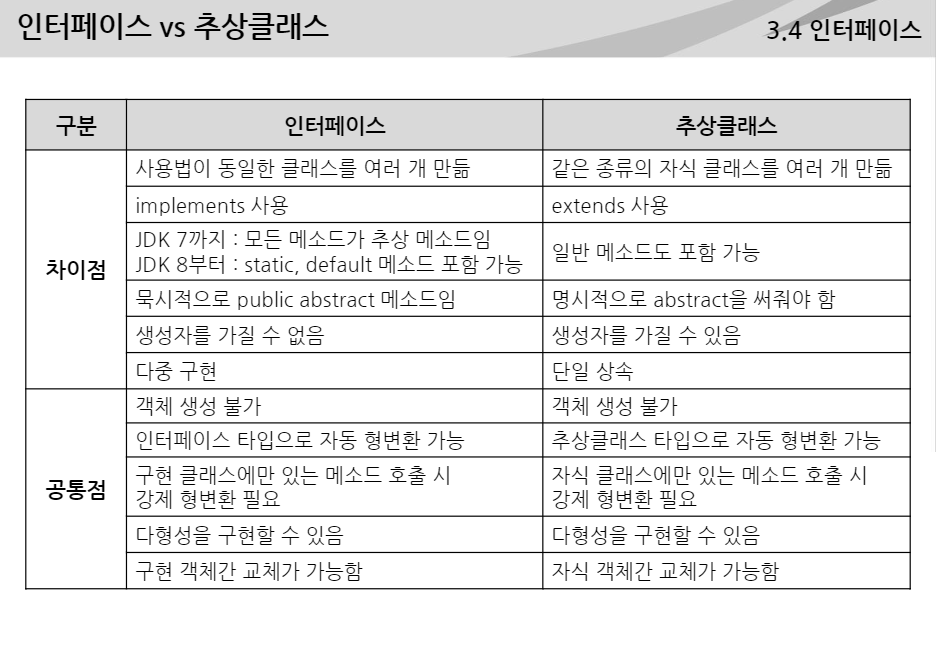

## JAVA

크로스 플랫폼 

객체지향적 프로그래밍 언어

제임스 고슬링 (썬 마이크로 시스템즈)

#### 특징 

+ 단순하고  쉬운 문법 제공
+ 객체 지향언어이다
+ 이식성이 높다, 플랫폼 독립적이다
+ 다양한 어플리케이션 개발 가능
+ 메모리를 자동으로 관리한다
+ 멀티스레드를 지원한다
+ 동적 로딩을 지원한다
+ 오픈 소스 라이브러리가 풍부하다

#### 자바의 실행


자바는 컴파일을 하면 바이트코드로 바뀌게 되어 어떠한 운영체제에서도 사용 가능하다.

#### 변수 명명규칙

+ 대소문자 구분되며 길이 제한 없다
+ 숫자로 시작하면 안된다
+ 특수문자는 _, $ 만 허용한다
+ 자바 예약어는 사용할 수 없다

#### 자바 데이터 타입

+ 기본형 :  primitive data type (ex : var 3.4)
  + 기본 데이터 타입으로 단일 값을 갖는다
  + 논리형, 문자형, 정수형, 실수형
+ 참조형 : reference data type (ex : var 0x1234)
  + 객체에 대한 주소값을 갖는다
  + primitive data type 제외한 모든 것

#### 자동 형 변환 : promotion

+ 상위 데이터 타입으로의 conversion은 자동 허용

```
byte b = 10;
int i = b;
double d = i;
```

#### 강제 형 변환 : casting

+ casting : 하위 데이터 타입으로 강제 변환되도록 명시

```
int i = 10;
byte b = (byte)i;
i = (int)3.14;
```

강제 형변환 시 알맞은 범위의 값이 할당되도록 주의하자

#### 연산자

+ 대입연산자
  + =, +=, -=, *=, /=
  + 오른쪽 표현식의 결과값을 완쪽 변수에 저장
+ 사칙연산자
  + +, -, *, /
+ 나머지연산자
  + %
+ 증감연산자
  + ++, --
+ 부호연산자
  + +, - (피연산자의 부호 변경에 사용)
+ 논리부정 연산자
  + ! (오직 논리형 변수에서만)
+ 대소비교 연산자
  + <, >, <=, >=
+ 등가비교 연산자
  + ==, !=
+ 논리 연산자
  + 피연산자로 boolean 또는 boolean 값을 결과로하는 Expression만을 허용
  + & , |
  + &&,  || -> short-Circuit Operators 왼쪽의 피연산자의 결과에 따라 오른쪽 피연산자 수행 안함
+ 삼항 연산자
  + 조건식 ? 값 또는 식 1 : 값 또는 식 2

#### 연산식에서의 형변환

+ 타입이 다른 두 변수를 연산한 결과 변수의 타입은 둘 중 큰 타입으로 된다
+ int 보다 작은 타입(byte, short, char)간의 연산의 결과는 int 타입이 된다

#### 절차적, 객체지향적

절차적 프로그래밍은 함수간의 호출 바탕 연속적인 계산 수행

여러 모듈에서 같이 사용하는 공통 변수가 있으면 -> 전역변수

객체지향적 프로그래밍은 데이터와 이를 처리하는 기능을 포함하는 객체 모델링, 이들 관계 정의

+ 객체(Object)
  + 현실 세계에서 자신의 속성(데이터) 와 행위(기능)을 갖고있는 모든 것
  + 속성 -> 필드, 행위 -> 메소드
  + 현실세계에서 일어나는 모든 현상 -> 객체간의 상호작용으로 이루어짐
  + 객체간의 상호작용은 메소드 호출을 통해 데이터를 서로 주고받음

#### 객체지향 프로그래밍

+ 객체들의 모임으로 파악하고자 하는 것
+ 각각의 객체는 메시지를 주고받고 데이터를 처리할 수 있다
+ s/w의 질을 향상하기 위해 강한 응집력, 약한 결합력 지향해야 함
+ 객체지향은 클래스에 하나의 문제 해결을 위한 데이터를 모아 놓은 데이터형을 사용함으로써 응집력 강화, 클래스간에 독립적으로 디자인함으로써 결합력 약하게 할 수 있다. 

#### 객체지향 프로그래밍 특징

+ 캡슐화 (Encapsulation)
+ 상속 (Inheritance)
+ 다형성 (Polymorphism)

#### 캡슐화

객체의 속성과 행위를 하나로 묶고, 실제 구현 내용을 감추는 것

객체 외부에서는 해당 객체에서 제공하는 필드와 메소드만 이용할 수 있다

#### 상속

부모 객체가 갖고있는 필드와 메소드 자식 객체에게 물려주는 것

중복코드 줄이고, 개발 생산성 높여준다

#### 다형성

같은 타입이지만 실행 결과가 다양한 형태로 나타난다는 것

일관된 인터페이스에 맞추어 구현, 그 실행 결과는 다르다

#### 클래스

1. 추상화 (Abstraction)
   + 객체로부터 프로그래밍 관점에서 필요한 속성과 기능을 추출해 내는 것
   + 추상화 작업의 결과로 클래스가 만들어진다

클래스는 객체 내의 속성(필드)와 기능(메소드)를 정의하는 일종의 설계도

객체를 만들기 위해서는 먼저 클래스 작성 후 객체 생성해야 한다

추상화 -> 클래스 설계 -> 클래스 작성 -> 객체 생성

2. 필드

   + 객체의 속성 의미, 객체의 데이터가 저장되는 곳
   + 객체 생성 시마다 Heap 영역에 독립된 공간이 만들어진다
   + 일반적으로 접근제어자 (Access Modifier)를 앞에 붙인다 (Public, Private)

3. 메소드

   + 객체의 기능(행위)를 의미한다
   + 메소드가 호출되면 수행에 필요한 메모리를 스택에서 할당받고, 종료되면 메모리를 반납한다
   + 1.접근 제어자, 2. 리턴타입, 3.메소드명 4,매개변수

   ```java
   public class Book {
       public(1) void(2) setTitle(3)(String newTitle(4)){
           title = new Title;
       }
   }
   ```

4. 패키지

   + 서로 관련이 있는 클래스들을 묶어서 관리하고자 할 떄 사용한다
   + 패키지가 다를 경우 같은 이름의 클래스라도 생성 가능하다
   + 패키지 선언 -> package 패키지명; ex) `package org.dimigo.basic;`
   + 모든 클래스는 첫 번째 문장에 단 한번만 패키지 선언
   + 점(.)을 구분자로 해서 계층구조 구성 가능(도메인 역순)
   + 패키지 선언하지 않고 클래스 작성하는 것은 권장하지 x

5. Import 문

   + 서로 다른 패키지에 있는 클래스 참조하기 위해 어느 패키지에 있는 클래스 인지를 알려줌
   + import문은 패키지 선언 다음, 클래스 선언 이전에 한다
   + import문 여러번 사용 가능
   + String 클래스와 같이 자주사용되는 클래스가 모여있는 java.lang 패키지는 import문 없이 사용 가능( 자동 추가)

#### 객체와 생성자

+ 일종의 설계된 클래스를 사용하여 사용할 수 있는 재품인 객체 생성
+ new 클래스명();
+ new 연산자는 Heap 영역에 생성된 객체의 주소 리턴
+ 리턴된 객체의 주소를 Reference 타입 변수에 저장하여 객체 사용

```java
public class Book{
    public String title;
    public int page;
    ...
}
Book book new Book();
Stack : book [0x100]
Heap : 0x100 [title null, page 0]
```

+ 객체의 필드 사용하기
+ Reference 변수가 객체의 주소 갖고 있으므로, 객체 사용할 수 있다.
+ `book.title`
+ 접근제어자 private로 바꾸면 `book.title`안됨 
+ 객체의 메소드 사용한다 (getter setter toString)
+ 객체가 객체 자신을 가리킬 때 this 사용한다.

```java
private String title;
public void setTitle(String title){
    this.title = title;
}
```

#### 생성자

+ 필드의 초기화 담당, 객체 사용 전에 필요한 작업 수행
+ 생성자 호출하지 않고는 클래스로부터 객체 만들 수 없다
+ 특징
  + 메소드처럼 클래스 내부에 선언
  + 생성자 이름은 클래스 이름과 동일
  + 리턴부 없다
  + 필요에 따라 여러개 생성자 가능
  + new이용해 객체 생성시 생성자가 호출
+ 기본 생성자 (Default Constructor)
  + 모든 클래스에는 생성자 반드시 하나 이상 존재
  + 생성자 정의하지 x -> 컴파일러가 자동으로 추가
  + 기본 생성자는 매개변수 없고, body부가 비어 있다
+ 기본 생성자 대신 직접 여러개 생성자 작성 가능
+ 생성자 하나라도 작성되어 있으면, 기본 생성자 자동 추가 안됨
+ 필드 초기화 순서 정리
  + 1. 필드 선언시 초기값을 준다 (초기값 없는 경우 기본값으로 자동 설정), 동일한 클래스로부터 생성되는 모든 객체가 동일한 필드값을 갖게 됨
    2. 생성자 이용하여 초기화한다
    3. 별도의 메소드를 사용하여 초기화한다
+ 생성자 오버로딩 : 매개 변수가 다른 생성자를 여러 개 선언
  + 매소드 이름이 같고, 매개변수 개수가 달라야 함
  + 매개변수 개수가 같은 경우 매개변수 타입이 달라야 함
+ 생성자 중복 코드를 줄이기 위해 this 이용하여 다른 생성자 호출 가능

#### Reference타입

레퍼런스 타입에서 생성된 객체는 Heap영역에서 GC (GarbageCollector)가 일어날 때 소멸된다

+ 메소드 호출 시 매개변수로 전달되는 값
  + Primitive : 실제 값
  + Reference : 객체의 주소 값
+ Reference 변수는 참조하는 객체가 없는 경우 null 값을 갖는다
+ String 도 클래스 타입이므로 String 변수도 null 값을 가질 수 있다

#### Reference 타입 - String

+ 자바는 모든 문자열을 String 타입의 객체로 표현한다
+ 객체는 Heap에 생성되므로 모든 문자열은 Heap에 만들어진다

```java
int age = 20;
String name = "권보성";
Stack : name [0x100], age[20]
Heap : 0x100["권보성"]
```

+ `String name = new String("권보성")`이렇게 만들 수 있다.
+ String 생성 방식 두가지
  + 문자열 리터럴 방식 : 문자열을 Literal Pool에 만든다, 해당 문자열이 없으면 문자열 객체 셍성, 동일 문자열 있으면 해당 객체 공유 `String str1 = "권보성"`
  + new 객체 방식 : 매번 다른 문자열 객체 생성
+ == 연산자는 객체의 주소값을 비교하므로 문자열의 내용 비교할 경우에 사용하지 않는다
+ 문자열 같은지 비교할 때 equals 매소드 사용 `st1.equals(str2)`
+ String 타입의 ref 변수가 아무런 문자열가리키지 않고 있으면 null 값이다
+ equals 매소드 호출 시 null 체크 먼저하거나, null 아닌 문자열 먼저 쓴다

#### StringBuffer, StrungBuilder

+ 한번 생성된 String 객체는 문자열 내용을 바꿀 수 없다
+ 문자열에 대한 추가, 변경 작업이 많은 경우에는 문자열 객체를 많이 생성하는 String 클래스 보다 StringBuffer, StringBuilder클래스를 사용한다
+ 두 개 클래스는 내부에 Buffer를 두어 문자열 연산을 하므로 속도가 더 빠르다

```java
StringBuilder sb = new StingBuilder("권");
sb.append("보성")
```

#### Reference 타입 - 배열

+ 같은 타입의 데이터 하나의 이름으로 관리

+ 연속된 공간에 저장, index 통해 접근

+ 반복문 -> 쉽게 처리 가능

+ 한번 생성된 배열 길이 변경 불가

+ 배열 길이 5 -> index 0 ~ 4

+ 자바의 배열은 객체, 모든 데이터 타입의 배열 만들 수 있음

  + Primitive 타입 : int, boolean, long, double
  + Reference 타입 : String, Book, Car

  `int[] intArr = null`,`int intArr[] = null` 

+ 배열도 객체이므로 new 객체 생성 연산자로 Heap 영역에 배열 생성

+ 배열 요소 개수 []안에 지정

+ 생성시 해당 타입의 기본값으로 초기화

```java
int[] intArr = null;
intArr = new int[5];
String[] strArr = new String[3];
Book[] bookArr = new Book[3]
Stack : bookArr[0x300], strArr[0x200], intArr[0x100]
Heap : 0x300[null,null,null], 0x200[null,null,null],0x100[0,0,0,0,0]
```

+ 배열의 이름은 Heap 영역에 생성된 배열 객체를 참조하는 Reference 변수이다
+ 배열의 초기화

```java
int[] intArr = {1, 2, 3};
int[] intArr = new int[]{1, 2, 3};
String[] strArr = {"김씨", "이씨"};
String[] strArr = new String[]{"김씨", "이씨"};
Book[] bookArr= { 
    new Book("미생","윤태호",1000), new Book("남한산성","김훈",500)}
```

+ 배열을 먼저 선언한 후 중괄호 {}를 이용한 초기화는 있을 수 없다
+ new 연산자를 사용하면 선언 후에도 중괄호 사용하여 초기화 가능

```java
String[] strArr = null;
strArr = {"서울","뉴욕","파리"}; 컴파일 에러
strArr = new String[]{"서울","뉴욕","파리"}; 가능
```

+ 배열의 길이 -> 배열명.length
+ 배열 index 범위 -> 0 ~ length-1

#### 자바의 2차원 배열

자바의 이차원 배열은 일차원 배열이 또 다른 일차원 배열을 참조하는 형태

+ 두번째 단계의 일차원 배열의 길이는 일정하지 않을 수 있다

```java
int[][] numbers = { {0,0,0}, {0,0,0} };
int[][] numbers = { new int[]{0,0,0}, new int[]{0,0,0} };
```

+  배열을 메소드 인자로 전달할 시에는 배열 객체의 주소값이 전달
+ 한번 생성된 배열의 길이는 변경할 수 없으므로, 더 큰 공간이 필요하면 새로운 배열을 생성한 후 값을 복사해야 한다

####  Reference타입 - Wrapper

기본형 데이터 타입 (Primitive Data Type)을 객체화 해준다

+ Boxing : 기본 자료형의 값을 Wrapper 클래스의 객체로 변경
+ Unboxing : Wrapper 클래스의 객체에서 기본 자료형의 값을 꺼내는 과정

```java
Integer ob1 = new Integer(1000);
Integer ob2 = Integer.valueOf("1000"); || valueOf(1000);
```

```java
Integer ob1 =new Integer(1000); //Boxing
int i = ob1.intValue(); //Unboxing
int i = Integer.parseInt("1000");
```

#### Static과 Final 키워드

+ 외부 메소드 호출 : 클래스 외부에서 메소드 호출 시에는 먼저 객체 생성 후 ref 변수 통해 메소드 호출 -> 객체 존재해야 호출 가능
+ 같은 클래스에 있는 내부 메소드 호출시에는 바로 메소드 이름으로 호출 -> 메소드 호출이 되었다는 건 이미 객체가 존재한다는 뜻이므로 메소드 바로 호출하면 됨

##### instance 맴버

+ Instance 멤버는 객체를 생성해야만 사용할 수 있는 필드와 메소드 -> 객체와 관련이 있다
+ 인스턴스 메소드에서 객체 자신의 인스턴스 멤버 접근시 this 사용 가능

##### static 맴버

+ 클래스 로더가 바이트 코드 읽어들일 때(클래스 로딩 시) 메소드 영역에 클래스 별 정적 필드와 정적 메소드가 미리 올라간다
+ 정적 맴버는 객체 생성하지 않고, 바로 사용할 수 있는 필드와 메소드 말한다 -> 클래스와 관련이 있어 클래스 멤버라고도 한다
+ 정적 필드와 정적 메소드 선언시에는 static 키워드 붙인다
+ static 메소드에서는 this를 사용할 수 없다


main에서 인스턴스 메소드 호출하려면 반드시 객체 생성 해야한다

객체마다 개별 데이터를 가지고 있어야 한다면 인스턴스 필드

객체마다 개별 데이터를 가지고 있을  필요가 없는 공용 데이터라면 정적 필드

인스턴스 필드를 사용하지 않는 메소드 -> 일반적으로 정적 메소드

+ 객체 생성 없이 바로 호출하므로 사용하기 편리, 시간 빠름


인스턴스 메소드에서 인스턴스 필드 바로 호출 가능

인스턴스 메소드에서 스테틱 필드 바로 호출 가능

스테틱 메소드에서 인스턴스 필드 바로 호출 불가능

스테틱 메소드에서 스테틱 필드 바로 호출 가능


인스턴스 메소드에서 인스턴스 필드 바로 호출 가능

인스턴스 메소드에서 스테틱 메소드 바로 호출 가능

스테틱 메소드에서 인스턴스 메소드 바로 호출 불가능

스테틱 메소드에서 스테틱 메소드 바로 호출 불가능


##### static 블록

+ 정적 필드의 초기값 계산 또는 클래스 로딩 시 초기화 작업에 사용
+ static 블록은 클래스가 메모리에 로딩될 때 최초 한번 실행
+ `static { } `

##### final 필드

+ 필드에 final을 붙이면 초기값이 저장된 이후에 값을 변경할 수 없다
+ 선언시 바로 초기화 할 수 있다
+ 생성자에서 초기화 할 수 도 있다

static final 필드로 만들면 클래스당 하나의 정적 필드가 만들어진다

-> 따라서 자바에서 상수는 static final을 붙인다

#### 상속

+ 기존의 클래스 재사용하여 새로운 클래스를 작성
+ 두 클래스를 부모와 자식 관계로 맺음
+ 자식 클래스 부모 클래스 맴버 사용 가능 (private 접근 제어자 부모 클래스 안됨)
+ 자식 클래스에서 자신에게 필요한 맴버 추가 정의


+ 보다 적은 양의 코드로 새로운 클래스 작성 가능
+ 코드 추가 및 변경 용이
+ 개발 생산성 높아지고, 유지보수 쉬워진다


+ is - a 관계가 성립해야 한다
+ 일반화 (Generalization) -> 자식에서 부모
+  구체화 (Specialization) -> 부모에서 자식
+ 자바에서 클래스 상속 시 자식 클래스에서 extends 키워드
+ 자바는 단일 상속만 지원

##### super 키워드

+ 자식 클래스에서 부모 객체 가리키는 자바 키워드
  + 인스턴스 필드 사용시 super.필드명
  + 인스턴스 메소드 사용시 super.메소드 명
  + 생성자 호출시 super(매개변수 리스트)
+ 자식 클래스, 부모 클래스 간 필드명, 메소드명이 중복되지 않으면 super 생략 가능

##### 객체 생성

자식 객체 생성 시 부모 객체를 먼저 생성한 후 자식 객체가 생성된다

자식 생성자 수행 시 부모 생성자 먼저 호출 후 자식 생성자 수행

-> 부모 생성자는 반드시 자식 생성자에 첫번째 줄에 작성

자식 생성자에서 명시적으로 부모 생성자 호출하지 않으면 컴파일러가 자동으로 부모의 기본 생성자 추가 (부모의 기본 생성자 없는 경우 컴파일 에러 발생)

##### 접근 제어자

+ public : public으로 지정한 필드나 메소드는 어느 곳에서나 접근 가능 (+)
+ protected : 같은 패키지 또는 자식 클래스 (#)
+ default : 같은 패키지에 있는 클래스, 접근 제어자 적지 x (~)
+ private : 자신의 클래스 내부에서만 (-)

##### 메소드 오버라이딩

+ 부모 클래스로부터 상속받은 메소드를 자식 클래스에 맞게 재정의 하는 것

1. 이름이 같아야 한다
2. 매개 변수의 개수, 타입 동일해야함
3. 리턴 타입 동일
4. 접근 제한을 더 강화하여 오버라이딩 할 수 없다

##### final

클래스 선언부에 붙이면 상속 못 받게 한다

메소드 선언부에 final을 붙이면 오버라이딩을 못하게 한다

##### object 클래스

모든 클래스의 부모 클래스

일반적으로 클래스 선언시 extends object 생략

##### 자동 형변환

자식 클래스의 타입은 부모 클래스의 타입으로 자동 형변환된다(Upcasting)

-> 부모 클래스 타입의 reference 변수는 자식 객체를 참조할 수 있다

##### 부모 타입으로 형 변환시 장점

+ 하나의 동일한 데이터 타입이므로 배열로 처리 가능
+ 부모타입의 매개변수를 받는 메소드 만들어 공통으로 사용 가능

##### -> 다형성

##### 부모 타입으로 형변환 시 주의 사항

부모타입으로 형변환하면 부모 클래스에서 선언된 필드와 메소드만 사용 가능

자식 클래스에서 오버라이딩하면 오버라이딩된 메소드가 실행

##### 동적 바인딩

+ 정적 바인딩 : 프로그램 실행 전에는 호출 부분과 실행 부분이 이미 결정되어 변경 x
+ 동적 바인딩 : 프로그램 실행 시에 실행되는 부분이 결정되고, 변경 가능

##### 강제 형변환

Upcasting 된 부모 타입을 자식 타입에 다기 넣을 때는 강제 Casting 해야함

```java
Aninal a = new Cat();
Cat c = (Cat) a; //a.dig(); -> error
c.dig();
```

실제 생성된 객체 타입으로만 강제 형변환 가능

Casting 잘못되면 런타임 에러 발생

##### instanceof 연산자

`A instanceof B` : A가 B의 타입이거나 자식인 경우 true

##### 정리하기

1. 자식 클래스 타입 -> 부모 클래스 타입으로 자동 형변환 됨
2. 부모 타입으로 형변환하면, 부모에 선언된 필드, 메소드 사용 가능
3. 자식 클래스에서 오버라이딩 했다면 오버라이딩 된 메소드 실행
4. 부모 타입으로의 자동 형변환, 동적 바인딩에 의한 오버라이딩 된 메소드 실행으로 다형성 구현 가능
5. 부모 타입을 자식 클래스 타입에 넣을 때는 강제 Casting 해야 함
6. 실제 생성한 객체 타입으로만 강제 형변환 가능
7. 안전한 casting위해 instanceof 연산자 사용

##### 추상클래스

자신은 객체를 생성하지 못하고, 반드시 상속받아 자식 객체를 만들어 사용해야 한다.

클래스 선언부에 final -> 상속을 못 받는다

메소드 선언부에 final -> 오버라이딩 안된다

클래스 선언부에 abstract -> 반드시 상속받아 사용해야 한다

메소드 선언부에 abstract -> 반드시 오버라이딩 해서 사용해야 한다

##### 추상 메소드

추상메소드는 구현부가 없으며, 자식 클래스에서 구현한다

##### Abstract 정리

추상 클래스는 직접 객체 생성이 안된다 -> 상속받은 자식 클래스를 통해 객체 생성해야 한다

추상 메소드는 자식 클래스에서 오버라이딩 하여 구현해야 한다 -> 반드시 구현해야 하는 기능을 강제화 할 수 있음

##### 인터페이스

클래스를 사용하는 하는 쪽 유저와 제공하는 쪽 프로바이더가 있다

유저 -> 내부 구현은 알 필요 없다

프로바이더 -> 인터페이스를 통해 어떻게 쓰는지만 알려주고, 내부 로직은 감춘다

인터페이스는 모든 메소드가 추상 메소드이다 (JDK 7까지)

-> 인터페이스 자체가 하나의 규격(명세)가 된다

인터페이스의 모든 메소드는 public abstract 이며, 생략 가능하다

인터페이스를 구현하고자 하는 클래스는 implements 키워드를 사용한다

클래스는 여러개의 인터페이스를 구현할 수 있다.(다중 구현 가능)

```java
public interface IExample{
    //인터페이스 선언
    }
```

```java
public class Example implements IExample{
    //인터페이스 구현
    }
```

```java
public interface IAnimal{
    String Fram_Name = "디미";//상수선언
    void eat();	//추상 메소드 선언 (public abstract)
    void sleep();
}
```

인터페이스는 잘 정의된 명세 이어야 한다 (Well -defined Specification)

JDK 8에서 부터는 인터페이스에 정적 메소드와 디폴트 메소드 작성할 수 있다

##### 인터페이스 장점

일관된 인터페이스가 가능하다 (확장성 및 유지 보수성이 좋아진다)

: 동일 인터페이스르 구현한 객체 간에 교체가 가능하다

자식 클래스에서 반드시 구현해야 하는 기능을 강제화 할 수 있다

독립적인 프로그래밍이 가능하다 -> 명세와 구현의 분리

상속 관계가 아니므로 여러개의 인터페이스를 동시에 구현할 수 있다

```java
public class Interfacelmpl implements InterfaceA, InterfaceB{}
```



##### 예외처리

Object 최상위 클래스, 그아래 Throwable, 그아래 Error와 Exception클래스

Exception 클래스

Checked Exception : 컴파일러가 발생 가능한 Exception을 알려주어 강제적으로 예외처리 요구하는 Exception으로 IOException 등이 속함

```java
public static void main(String[] args) {
	checkedException();
}
public static void checkedException(){
    BufferReader br = new BufferedReader(new FileReader("input.txt"));
}
```

에러 발생 -> java.io.FileNotFoundException, 즉 예외처리를 해줘야함 

```java
public static void main(String[] args) {
	checkedException();
}
public static void checkedException(){
    try{
    	BufferReader br = new BufferedReader(new FileReader("input.txt"));
    } catch(FileNotFoundException fne){
        System.out.println("파일이 없다")
    }
}
```


Unchecked Exception: 컴파일러가 강제적으로 예외처리를 요구하지 않는 Exception

##### 컬랙션

다수의 데이터를 쉽게 처리(추가,삭제,변경)할 수 있는 표준화된 방법

컬랙션을 사용하면 객체저장 시 크기가 자동으로 늘어나서 훨씬 쉽게 처리할 수 있다

+ List 계열, Map 계열, Set 계열

+ List 계열

  + ArrayList

    리스트에서 객체를 얻어내는데 효율적이고, 동기화 제공하지 않는다

    동기화는 멀티스레드 환경에서 다른 스레드가 처리가 끝날 때 까지 대기하고 있는 것

    ```java
    List<타입> ref 변수 = new ArrayList<>();
    List<String> list =new ArrayList<>();
    list.add("사과");
    list.add("딸기");
    ```

+ Map 계열

  + Key 값과 Value를 쌍으로 저장하는 컬렉션

  + 키는 중복될 수 없다

  + HashMap

    저장되는 순서가 유지되지 않는다

    동일한 키로 값을 저장하면 새로운 값으로 덮어 씌워진다

    ```java
    Map<String, Integer> map = new HashMap<>();
    map.put("kor",100);
    ```

    ```java
    public static void printMap(Map<String, Integer> map) {
    	for(String key : map.keySet()) {
    		System.out.print(key + ":" + map.get(key) + " | ");
    	}
    	System.out.println();
    }
    ```

    